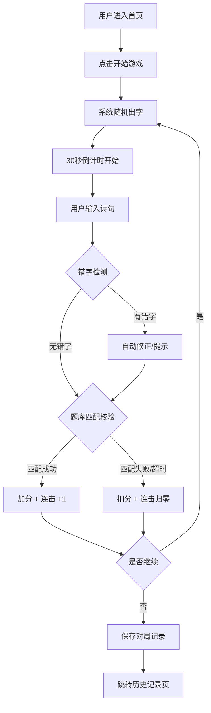

## 1. 产品概述
古诗词文字接龙小游戏，玩家根据随机给出的汉字，在限定时间内输入包含该字的经典古诗词句。
- 面向热爱古典文学、希望寓教于乐的普通用户与学生群体
- 通过游戏化方式提升古诗词积累量，传承中华传统文化

## 2. 核心功能

### 2.1 功能模块
1. **游戏主页面**：随机出字展示、诗句输入框、计时器、分数面板、提示按钮
2. **历史记录页**：对局历史、得分统计、答题回顾
3. **题库系统**：内置 3000+ 古诗词数据

### 2.2 页面详情
| 页面名称 | 模块名称 | 功能描述 |
|-----------|-------------|---------------------|
| 游戏主页 | 随机出字卡片 | 展示当前目标汉字，带动画效果 |
| 游戏主页 | 诗句输入框 | 支持中文输入，实时错字检测与修正提示 |
| 游戏主页 | 计时器 | 每题 30 秒倒计时，紧张感进度条 |
| 游戏主页 | 计分板 | 当前得分、连击数、已答题目数 |
| 游戏主页 | 提示系统 | 提供字提示、句提示（消耗分数） |
| 游戏主页 | 反馈动画 | 答对/答错动态反馈效果 |
| 历史记录 | 对局列表 | 展示历史对局得分、时间、正确率 |
| 历史记录 | 答题回顾 | 查看每局答题详情与正确诗句 |
| 导航栏 | 页面切换 | 游戏 / 历史 两栏导航 |

## 3. 核心流程
用户进入首页 → 点击开始游戏 → 系统随机抽取常用汉字 → 倒计时 30 秒开始 → 用户输入诗句 → 系统校验（错字修正 + 题库匹配）→ 答对加分/答错扣分 → 下一题或结束 → 保存对局记录至历史页

## 4. 用户界面设计

### 4.1 设计风格
- **主色调**：米杏色 `#F5F0E6` 为底，墨黑色 `#2C2C2C` 为文字主色，朱砂红 `#C84B31` 为强调色，竹青色 `#6B8E23` 为辅助色
- **字体**：标题使用「思源宋体」，正文使用「霞鹜文楷」，营造古籍书香氛围
- **按钮风格**：圆角中等 `8px`，微浮雕效果，悬停轻微上浮 + 朱砂色描边
- **布局风格**：居中卡片式布局，大量留白，辅以水墨晕染装饰边框
- **图标风格**：线性简约中式图标（梅花、毛笔、书卷、印章等元素）

### 4.2 页面设计概述
| 页面名称 | 模块名称 | UI 元素 |
|-----------|-------------|-------------|
| 游戏主页 | 出字卡片 | 大号汉字居中，米白宣纸纹理背景，朱砂印章边框，淡入动画 |
| 游戏主页 | 输入区域 | 楷体输入框，毛笔光标，答实时反馈下划线 |
| 游戏主页 | 计时进度条 | 朱红色渐变，时间紧迫时闪烁提醒 |
| 游戏主页 | 分数面板 | 书卷展开式设计，得分、连击、题次横排展示 |
| 游戏主页 | 提示按钮 | 竹青色，毛笔图标，点击展开提示层级 |
| 历史记录 | 记录卡片 | 古籍书页样式，页眉页脚装饰线，悬停轻微泛黄 |
| 导航栏 | 顶部导航 | 极简宋体文字，朱砂下划线标识当前页 |

### 4.3 响应式设计
- 桌面端优先：居中卡片最大宽度 `900px`
- 移动端适配：卡片宽度 `92vw`，字号自动缩放，触摸按钮最小 `44px`
- 竖屏优化：出字卡片与输入区纵向堆叠，保证单手可操作
