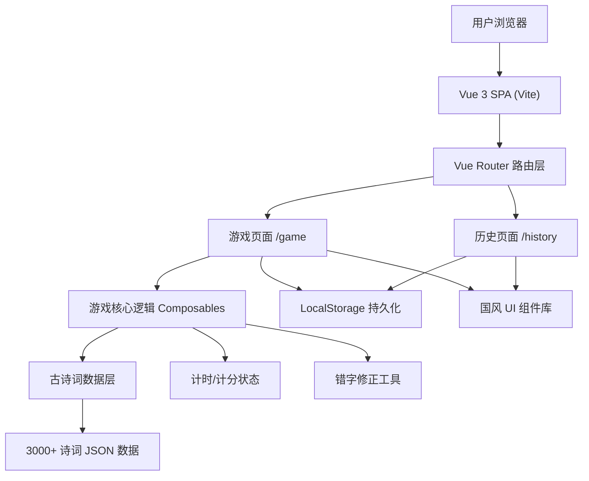

## 1. 架构设计



## 2. 技术描述
- **前端框架**：Vue 3 + TypeScript + Vite 6
- **路由管理**：Vue Router 4
- **样式方案**：Tailwind CSS 3 + 自定义国风主题
- **状态管理**：Vue Composition API + Composables
- **数据持久化**：LocalStorage（历史对局记录）
- **数据来源**：内置古诗词 JSON 数据集（3000+ 条）
- **汉字处理**：pinyin-pro（拼音处理、错字模糊匹配）

## 3. 路由定义
| 路由 | 页面组件 | 用途 |
|-------|---------|-----|
| / | GamePage.vue | 游戏主页（默认路由） |
| /game | GamePage.vue | 游戏主页 |
| /history | HistoryPage.vue | 历史对局记录页 |

## 4. 数据模型

### 4.1 古诗词数据结构
```typescript
interface Poem {
  id: number
  title: string      // 诗词标题
  author: string     // 作者
  dynasty: string    // 朝代
  content: string[]  // 诗词内容（按句分割的数组）
  tags?: string[]    // 标签（可选）
}
```

### 4.2 游戏状态
```typescript
interface GameState {
  status: 'idle' | 'playing' | 'paused' | 'ended'
  currentChar: string        // 当前目标汉字
  score: number              // 当前得分
  combo: number              // 连击数
  maxCombo: number           // 最高连击
  answeredCount: number      // 已答题数
  correctCount: number       // 答对数
  timeLeft: number           // 剩余时间（秒）
  totalTime: number          // 本局总用时
  hintsUsed: number          // 使用提示次数
  currentAnswers: AnswerRecord[]
}

interface AnswerRecord {
  targetChar: string         // 目标汉字
  userInput: string          // 用户输入
  correctedInput: string     // 修正后的输入
  isCorrect: boolean         // 是否正确
  matchedPoem?: Poem         // 匹配到的诗词
  matchedSentence?: string   // 匹配到的诗句
  timeSpent: number          // 用时（秒）
  scoreChange: number        // 分数变化
  timestamp: number
}
```

### 4.3 历史对局记录
```typescript
interface GameRecord {
  id: string                 // 记录 ID
  startTime: number          // 开始时间戳
  endTime: number            // 结束时间戳
  finalScore: number         // 最终得分
  totalQuestions: number     // 总题数
  correctCount: number       // 答对数
  accuracy: number           // 正确率 0-1
  maxCombo: number           // 最高连击
  answers: AnswerRecord[]    // 答题详情
}
```

## 5. 核心模块文件结构
```
src/
├── components/
│   ├── game/
│   │   ├── CharacterCard.vue      # 出字卡片
│   │   ├── PoemInput.vue          # 诗句输入框
│   │   ├── TimerBar.vue           # 计时器进度条
│   │   ├── ScorePanel.vue         # 分数面板
│   │   ├── HintButton.vue         # 提示按钮
│   │   └── FeedbackToast.vue      # 答对/答错反馈
│   ├── history/
│   │   ├── RecordCard.vue         # 对局记录卡片
│   │   └── AnswerDetail.vue       # 答题详情
│   └── layout/
│       ├── NavBar.vue             # 顶部导航
│       └── InkBorder.vue          # 水墨边框装饰
├── composables/
│   ├── useGame.ts                 # 游戏核心逻辑
│   ├── useTimer.ts                # 计时器
│   ├── usePoemMatcher.ts          # 诗词匹配引擎
│   ├── useTypoCorrection.ts       # 错字修正
│   └── useHistory.ts              # 历史记录管理
├── data/
│   ├── poems.json                 # 3000+ 古诗词数据
│   └── common-chars.json          # 常用汉字列表（出题用）
├── pages/
│   ├── GamePage.vue               # 游戏主页
│   └── HistoryPage.vue            # 历史记录页
├── utils/
│   ├── char.ts                    # 汉字工具函数
│   ├── storage.ts                 # LocalStorage 封装
│   └── random.ts                  # 随机工具
├── router/
│   └── index.ts                   # 路由配置
├── App.vue
├── main.ts
└── style.css                      # 全局样式 + Tailwind 主题
```

## 6. 关键算法说明

### 6.1 随机出字算法
- 从 `common-chars.json`（约 2000 个常用汉字）中随机抽取
- 加权策略：优先选择在诗词库中出现频次高的汉字（至少 20 首诗包含）
- 避免近期重复：记录最近 20 题的汉字，不重复抽取

### 6.2 诗句匹配算法
1. **精确匹配**：遍历所有诗词内容，查找包含目标汉字且与用户输入（≥5字）完全匹配的句子
2. **模糊匹配**：若精确匹配失败，使用编辑距离 ≤ 2 进行模糊匹配（去除标点后）
3. **返回结果**：匹配到的诗词对象 + 完整诗句

### 6.3 错字自动修正
- 基于拼音相似度：使用 `pinyin-pro` 将输入转为拼音，与诗词库中同音/近音词比对
- 基于编辑距离：对输入和候选诗句计算 Levenshtein 距离，取最小编辑距离的候选
- 仅对 1-2 字差异进行自动修正，差异过大则仅提示不修正

### 6.4 计分规则
| 事件 | 分数变化 |
|-----|---------|
| 答对（无提示） | +10 + 连击×2 |
| 答对（字提示） | +5 |
| 答对（句提示） | +2 |
| 答错/超时 | -5 |
| 使用字提示 | 额外 -3 |
| 使用句提示 | 额外 -8 |
